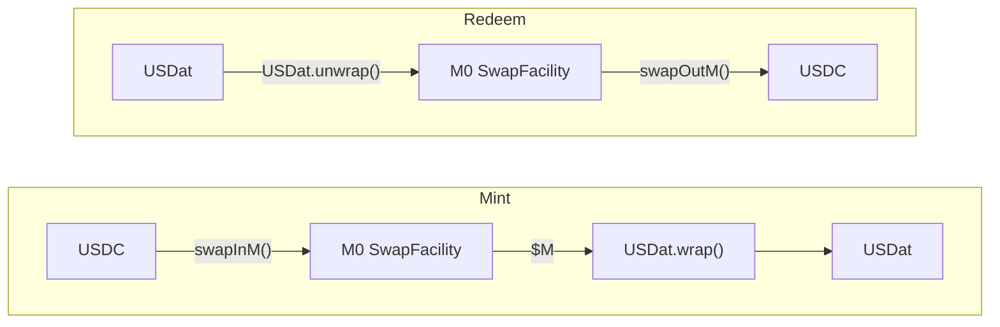

# saturn-dollar — USDat

USDat is Saturn's non-yielding stablecoin, minted 1:1 against M0's `$M` (tokenized US T-bills). It is the base layer of the Saturn protocol: whitelisted users deposit USDC, receive USDat, and can optionally stake into [saturn-yield-dollar](https://github.com/saturn-organization/saturn-yield-dollar) to earn yield from STRC dividends.

## How it works

Mint and redemption route exclusively through the **M0 SwapFacility** — there is no direct USDC deposit function on the contract itself.



USDat is an **M0 M-Extension** (`JMIExtension`) with two additions on top:

- **Whitelist** — togglable; when enabled, only approved addresses can wrap, unwrap, or receive freshly wrapped tokens (secondary ERC20 transfers are not restricted)
- **Forced transfer** — compliance role can force-transfer tokens from a frozen account (regulatory seizure)

## Contracts

```
src/
├── USDat.sol          # Main contract: JMIExtension + whitelist + forced transfer
└── IUSDat.sol         # Interface

script/
├── USDat.s.sol        # Deploy via CREATE3 (deterministic address across chains)
├── UpgradeUSDat.s.sol # Upgrade implementation
└── README.md          # Full deployment reference
```

### Roles

| Role | Who | Can do |
|---|---|---|
| `DEFAULT_ADMIN_ROLE` | Admin multisig | ProxyAdmin owner, grant/revoke roles |
| `WHITELIST_MANAGER_ROLE` | Compliance | Enable/disable whitelist, add/remove addresses |
| `PROCESSOR_ROLE` | Processor | M0 processor callbacks |
| Compliance (ForcedTransferable) | Compliance | Freeze accounts, force-transfer balances |

## Deployed addresses

| Network | Proxy |
|---|---|
| Ethereum mainnet | `0x23238f20b894f29041f48D88eE91131C395Aaa71` |
| Sepolia testnet | see `broadcast/USDat.s.sol/11155111/` |

The proxy address is deterministic via [CreateX](https://github.com/pcaversaccio/createx) (`0xba5Ed099633D3B313e4D5F7bdc1305d3c28ba5Ed`) with salt `"USDat"`. Same address on all chains when deployed from `0x8CBA689B49f15E0a3c8770496Df8E88952d6851d`.

## Development

```bash
forge install
forge build
forge test
forge fmt
```

## Deployment

Set the following in `.env` (see `script/README.md` for full reference):

```bash
PRIVATE_KEY=<deployer key>
RPC_URL=<rpc endpoint>
M_TOKEN=<M0 $M token address>
SWAP_FACILITY=<M0 SwapFacility address>
ADMIN=<admin address>
COMPLIANCE=<compliance address>
PROCESSOR=<processor address>
YIELD_RECIPIENT=<yield recipient address>
```

```bash
source .env && forge script script/USDat.s.sol:DeployUSDat \
  --rpc-url $RPC_URL --broadcast --private-key $PRIVATE_KEY
```

To upgrade the implementation without changing the proxy address:

```bash
forge script script/UpgradeUSDat.s.sol --rpc-url $RPC_URL --broadcast
```

## Dependencies

- [m0-foundation/evm-m-extensions](https://github.com/m0-foundation/evm-m-extensions) — `JMIExtension` base and SwapFacility integration
- [OpenZeppelin Contracts Upgradeable](https://github.com/OpenZeppelin/openzeppelin-contracts-upgradeable) v5
- [pcaversaccio/createx](https://github.com/pcaversaccio/createx) — deterministic cross-chain deployment

## Security

Audited by Three Sigma, Certora, and Cerotra. Reports are available on the Saturn GitBook.

USDat uses `TransparentUpgradeableProxy` (OZ v5). Upgrades are gated by the ProxyAdmin owner (`DEFAULT_ADMIN_ROLE`).
