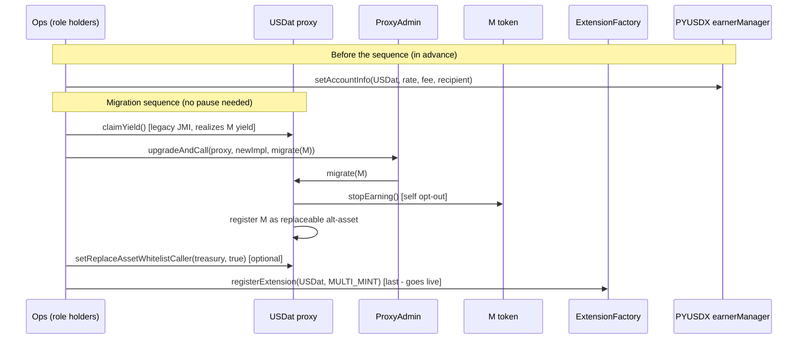

# USDat → PYUSDX Migration Runbook

**Date:** 2026-06-10
**Status:** Migration plan (implementation merged on `proto-963-migrate-usdat-code-to-pyusdx`)
**Scope:** Operational steps to migrate the live USDat proxy from the M-backed `JMIExtension` implementation to the PYUSDX `MultiMint` implementation, including prerequisites and the JMI → MultiMint behavioural differences operators must account for.

---

## 1. Summary

USDat lives behind a `TransparentUpgradeableProxy` (`0x23238f20b894f29041f48D88eE91131C395Aaa71`). Today it is an M-backed `JMIExtension`. The new implementation re-points USDat at the **PYUSDX `MultiMint`** base.

The migration is an **upgrade-only** path: the new `USDat` exposes no `initialize`, only a one-shot `migrate(address mToken)` reinitializer. Because the live proxy is already initialized and holds all roles/balances/state, `migrate` only:

1. **Stops M earning** (self opt-out via the M token's no-arg `stopEarning()`), and
2. **Registers the held M as a replaceable MultiMint alt-asset**, so the existing M reserves carry over and are converted to PYUSDX **incrementally** via `replaceAsset` — **no up-front PYUSDX outlay** at upgrade.

> The accounting and `migrate` design rationale are documented in `plans/usdat-migration-m-as-replaceable-asset.md`. This doc is the **operational runbook + prerequisites**.

---

## 2. Key differences: JMIExtension → MultiMint

These behavioural changes must be accounted for operationally.

<table fit-page-width="true" header-row="true">
	<tr>
		<td>Concern</td>
		<td>JMIExtension (old)</td>
		<td>MultiMint (new)</td>
	</tr>
	<tr>
		<td>**Backing asset**</td>
		<td>M (primary), plus alt-assets (USDC)</td>
		<td>PYUSDX (primary). M becomes a replaceable alt-asset; unwrap returns PYUSDX</td>
	</tr>
	<tr>
		<td>**`claimYield()`**</td>
		<td>Permissionless; realizes **M** yield</td>
		<td>**Permissioned** — `onlyRole(YIELD_RECIPIENT_MANAGER_ROLE)`; realizes **PYUSDX** yield (`claimFor`) then mints extension tokens to `yieldRecipient`</td>
	</tr>
	<tr>
		<td>**Yield source**</td>
		<td>M earning via TTG approved-earner list</td>
		<td>PYUSDX per-account earning, configured by the PYUSDX `earnerManager` (`setAccountInfo`)</td>
	</tr>
	<tr>
		<td>**Swap facility**</td>
		<td>M SwapFacility `0xB680…6278`</td>
		<td>PYUSDX SwapFacility `0x0bC3…4173`</td>
	</tr>
	<tr>
		<td>**Extension registry**</td>
		<td>n/a</td>
		<td>Must be an approved extension in the PYUSDX `ExtensionFactory` for SwapFacility wrap/unwrap/replaceAsset to work</td>
	</tr>
	<tr>
		<td>**New role**</td>
		<td>—</td>
		<td>`ASSET_CAP_MANAGER_ROLE` — controls asset caps and the `replaceAsset` whitelist</td>
	</tr>
	<tr>
		<td>**Version pinning**</td>
		<td>Beacon-based</td>
		<td>Disabled — `pinVersion`/`unpinVersion` revert `VersionPinningDisabled` (transparent proxy, no origin beacon). `VERSION_MANAGER_ROLE` is inert</td>
	</tr>
	<tr>
		<td>**Entry point**</td>
		<td>`initialize`</td>
		<td>`migrate(mToken)` reinitializer — no public `initialize`</td>
	</tr>
	<tr>
		<td>**Whitelist (compliance)**</td>
		<td>Preserved</td>
		<td>Preserved — gates `wrap`/`unwrap` only; **`replaceAsset` is NOT whitelist-gated** (it has its own `replaceAssetWhitelist`)</td>
	</tr>
</table>

<callout icon="⚠️" color="red_bg">
**`claimYield()` is now permissioned.** Any off-chain automation or integrator that previously called USDat's permissionless `claimYield()` will break — it now reverts for anyone without `YIELD_RECIPIENT_MANAGER_ROLE`. Notify integrators before the upgrade.
</callout>

---

## 3. Prerequisites (before the migration tx)

<callout icon="📋" color="blue_bg">
These must be ready/coordinated **before** executing the migration sequence in §4. The **PYUSDX earner registration (item 2) is done before the upgrade** — keyed by account address, so it works against the proxy regardless of the live implementation. **ExtensionFactory registration (item 3) is post-upgrade and is the migration's final step — it gates the SwapFacility, so no `pause` is needed** (see §4). The **`replaceAsset` whitelist (item 4) is optional**. (Deploying the new implementation is **not** a separate step — `Upgrades.upgradeProxy` deploys it inside the upgrade tx; see §4 step 2.)
</callout>

1. **Confirm mainnet addresses** for PYUSDX, the PYUSDX SwapFacility, ExtensionFactory, the PYUSDX `earnerManager`, and the M token (6-decimals) — see §7.
2. **PYUSDX earner registration (do this *before* the upgrade)** — add USDat to the list of PYUSDX earners: the PYUSDX `earnerManager` calls `setAccountInfo(USDat, earnerRate, feeRate, claimRecipient)`. **Decide `earnerRate`, `feeRate`, and `claimRecipient`** with the PYUSDX team. `setAccountInfo` is keyed by account address, so it works while USDat is still the JMI impl — and it is inert until USDat holds PYUSDX, so doing it ahead of the upgrade has no side effects. Without this, USDat accrues no PYUSDX yield.
3. **ExtensionFactory registration (post-upgrade only, run last)** — a `FACTORY_MANAGER_ROLE` holder must call `registerExtension(USDat, ExtensionType.MULTI_MINT)`. The factory validates `USDat.pyusdx()` and `USDat.swapFacility()` match its configured values — selectors that only resolve to the PYUSDX values **after** `migrate`, so this **cannot** run before the upgrade (the legacy JMI proxy has no `pyusdx()`). Until registered, all SwapFacility paths (`swapIn`/`swapOut`/`replaceAsset`) revert `NotApprovedExtension` — which is why registration doubles as the migration's gate and is run **last**, removing the need to pause.
4. **`replaceAsset` whitelist plan (optional)** — while the whitelist is empty, `replaceAsset` is open to anyone. If the team wants to restrict the M→PYUSDX wind-down to specific treasury / market-maker address(es), add them via `setReplaceAssetWhitelistCaller` (`ASSET_CAP_MANAGER_ROLE`) **before** the ExtensionFactory registration, so `replaceAsset` is never open once USDat goes live. If permissionless `replaceAsset` is acceptable, skip this.
5. **Confirm authority holders** are available to sign (see role table in §6).

---

## 4. Migration runbook (ordered transaction sequence)

<callout icon="🔒" color="red_bg">
**`migrate` is reinitializer-guarded but NOT role-gated.** Under `upgradeAndCall`, `msg.sender` is the `ProxyAdmin` (which holds no role). It MUST run **atomically** as the `data` of `ProxyAdmin.upgradeAndCall(proxy, newImpl, migrate(mToken))`. Upgrading the impl in a separate tx would let anyone front-run `migrate` with a malicious `mToken`.
</callout>

**Before the sequence (in advance):** PYUSDX earner registration — the PYUSDX `earnerManager` calls `setAccountInfo(USDat, earnerRate, feeRate, claimRecipient)` (§3 item 2). Keyed by account address, so it runs while USDat is still the JMI impl.

Then execute the following as an **ordered transaction sequence** signed by the respective authorities. There is **no single multiSend**: the ProxyAdmin owner `0x610182581C93687Ca03F4a8E7f124f8cEC616820` is an **EOA** (not a Safe), and the steps span several role holders (§6). The only hard atomicity requirement is the impl-swap + `migrate`, which `Upgrades.upgradeProxy` already runs in **one** `upgradeAndCall` tx (the front-running protection above).

**No `pause`/`unpause` is needed.** ExtensionFactory registration is the gate: until USDat is registered, every SwapFacility path (`wrap`/`unwrap`/`replaceAsset`) reverts `NotApprovedExtension`. Registering **last** keeps the contract effectively closed throughout the upgrade — plain ERC20 transfers (always allowed, unchanged by `migrate`) are the only thing live in the meantime.

**Steps 1–2 are bundled in the upgrade script** `_upgradeAndMigrate()` (`script/UpgradeUSDatBase.sol`): a single `forge script` run claims the M yield (L29–30) then deploys + upgrades + migrates (L40). Steps 3–4 are separate follow-up transactions.

1. **`usdat.claimYield()`** on the **live JMI** proxy — **run by the script** (`script/UpgradeUSDatBase.sol:29-30`), immediately before the upgrade. Permissionless on JMI; realizes outstanding **M** yield to `yieldRecipient` and makes `mBalance == totalSupply − totalAssets`. **Required**: `migrate` reverts `MReservesMismatch` if unrealized M yield remains.
2. **`Upgrades.upgradeProxy(...)`** (same script, `script/UpgradeUSDatBase.sol:40`) — **deploys the new implementation** (constructor args `(PYUSDX, PYUSDX_SWAP_FACILITY)`; OZ validation with `unsafeSkipStorageCheck` + `missing-initializer` allowed, since the JMI layout reference is skipped intentionally) and atomically calls `ProxyAdmin.upgradeAndCall(proxy, newImpl, migrate(M_TOKEN))`. `migrate` then self-stops M earning and registers the held M as a replaceable alt-asset (`cap = balance = mBalance`, `decimals = 6`; `totalAssets += mBalance`).
3. **(Optional) `usdat.setReplaceAssetWhitelistCaller(treasury, true)`** — `ASSET_CAP_MANAGER_ROLE`. Only if restricting `replaceAsset` to specific callers (§3 item 4); run it **before** step 4 so `replaceAsset` is never open once registered. Skip if permissionless `replaceAsset` is acceptable.
4. **`ExtensionFactory.registerExtension(USDat, MULTI_MINT)`** — `FACTORY_MANAGER_ROLE`. **Last step** — flips USDat live (SwapFacility `wrap`/`unwrap`/`replaceAsset` start working).



### Running the upgrade script

Steps 1–2 are run via the `Makefile`. Set these env vars in `.env`:

```bash
# Mainnet RPC URL
MAINNET_RPC_URL=

# Etherscan verification
ETHERSCAN_API_KEY=
MAINNET_VERIFIER_URL="https://api.etherscan.io/v2/api?chainid=1"

# Signer — the ProxyAdmin owner EOA
PROXY_ADMIN_OWNER_PRIVATE_KEY=

# Only for the mainnet-fork dry run (upgrade-local)
LOCALHOST_RPC_URL=
```

- **Mainnet run:** `make upgrade-mainnet` (`Makefile:18-20`) — runs `script/UpgradeUSDat.s.sol` against `MAINNET_RPC_URL`, signed by `PROXY_ADMIN_OWNER_PRIVATE_KEY`, with `--broadcast --verify`.
- **Mainnet-fork dry run:** `make upgrade-local` (`Makefile:14-16`) — the same script against `LOCALHOST_RPC_URL` (e.g. an `anvil --fork-url $MAINNET_RPC_URL` node). Rehearse the full upgrade here before the real run.

Steps 3–4 (optional `replaceAsset` whitelist, then `registerExtension`) are sent separately by their respective role holders (§6).

---

## 5. Post-migration wind-down (M → PYUSDX)

Once USDat is registered (§4 step 4), it is fully PYUSDX-native but its backing is still mostly M.

- A whitelisted treasury/MM calls the PYUSDX **SwapFacility `replaceAsset`** path: deposit PYUSDX, receive M 1:1. Each call decreases `assetBalanceOf(M)` and `totalAssets`, and increases PYUSDX backing.
- This is **incremental and market-/treasury-driven** — no single-tx outlay.
- When `assetBalanceOf(M) == 0`, call **`setAssetCap(M, 0)`** (`ASSET_CAP_MANAGER_ROLE`) to de-register M. Migration complete.

<callout icon="ℹ️" color="yellow_bg">
**Unwrap capacity ramps with PYUSDX reserves.** Immediately post-migrate `_pyusdxBacking() == 0`, so `unwrap` reverts (`InsufficientPYUSDXBacking`) until `replaceAsset` builds PYUSDX reserves. **Transfers and wraps of other assets are unaffected.** This self-heals as M is replaced. M re-wrapping is blocked while `cap == balance`; as `replaceAsset` drains M, the freed headroom (`cap - balance`) would technically re-open M wrapping, so the `ASSET_CAP_MANAGER_ROLE` can lower the M cap to track the balance (`setAssetCap(M, assetBalanceOf(M))`) to keep it closed. In practice this is belt-and-suspenders — USDat's compliance whitelist already limits wraps to whitelisted addresses, none of which would wrap M.
</callout>

---

## 6. Roles & authorities (live at fork block)

<table fit-page-width="true" header-row="true">
	<tr>
		<td>Role</td>
		<td>Holder</td>
		<td>Used for</td>
	</tr>
	<tr>
		<td>`DEFAULT_ADMIN_ROLE` + ProxyAdmin owner</td>
		<td>`0x610182581C93687Ca03F4a8E7f124f8cEC616820` (EOA)</td>
		<td>`upgradeAndCall` (the migration tx)</td>
	</tr>
	<tr>
		<td>`PAUSER_ROLE` / `FREEZE` / `FORCED_TRANSFER` / `WHITELIST_MANAGER`</td>
		<td>`0x10D59F776db12b4B271b2609CB8b7Ddd0A82703B`</td>
		<td>operational pause control (not used by the no-pause migration)</td>
	</tr>
	<tr>
		<td>`YIELD_RECIPIENT_MANAGER_ROLE`</td>
		<td>`0x09D6E34cE24D54890fF0BC6a090b5f880F8C729f`</td>
		<td>post-migration `claimYield` (now permissioned)</td>
	</tr>
	<tr>
		<td>`ASSET_CAP_MANAGER_ROLE`</td>
		<td>`0x7D343D17896D2cd87A49b4fB8872298A883f78f7`</td>
		<td>`replaceAsset` whitelist; `setAssetCap(M, 0)` at end</td>
	</tr>
	<tr>
		<td>`FACTORY_MANAGER_ROLE` (ExtensionFactory)</td>
		<td>*confirm with PYUSDX team*</td>
		<td>`registerExtension(USDat, MULTI_MINT)`</td>
	</tr>
	<tr>
		<td>PYUSDX `earnerManager`</td>
		<td>*confirm with PYUSDX team*</td>
		<td>`setAccountInfo(USDat, …)` earner registration</td>
	</tr>
	<tr>
		<td>`VERSION_MANAGER_ROLE`</td>
		<td>unassigned (inert — pinning disabled)</td>
		<td>—</td>
	</tr>
</table>

All AccessControl state carries over the upgrade (verified by `test/UpgradeUSDatFork.t.sol::test_upgrade_preservesRoles`).

---

## 7. Address reference (mainnet)

<table fit-page-width="true" header-row="true">
	<tr><td>Contract</td><td>Address</td></tr>
	<tr><td>USDat proxy</td><td>`0x23238f20b894f29041f48D88eE91131C395Aaa71`</td></tr>
	<tr><td>M token</td><td>`0x866A2BF4E572CbcF37D5071A7a58503Bfb36be1b`</td></tr>
	<tr><td>PYUSDX</td><td>`0xeBDB0942cE16386Ab90718C7BD10C91CDb66b14d`</td></tr>
	<tr><td>PYUSDX SwapFacility</td><td>`0x0bC305e7e13113cAEd3f5486849e9518a1cC4173`</td></tr>
	<tr><td>M SwapFacility (legacy)</td><td>`0xB6807116b3B1B321a390594e31ECD6e0076f6278`</td></tr>
	<tr><td>USDC (existing alt-asset)</td><td>`0xA0b86991c6218b36c1d19D4a2e9Eb0cE3606eB48`</td></tr>
	<tr><td>ExtensionFactory</td><td>*confirm on mainnet*</td></tr>
</table>

---

## 8. Verification checklist (post-migration)

Mirrors the assertions in `test/UpgradeUSDatFork.t.sol`:

- [ ] `usdat.pyusdx() == PYUSDX` and `usdat.swapFacility() == PYUSDX_SwapFacility`
- [ ] `claimYield` realized pending M yield → `totalSupply` and `yieldRecipient` balance increased by the pending yield
- [ ] `assetCap(M) == assetBalanceOf(M) == held M balance`, `assetDecimals(M) == 6`
- [ ] `totalAssets == M balance + USDC balance`; USDC backing unchanged
- [ ] `isAllowedToWrap(M, 1) == false` (cap == balance)
- [ ] PYUSDX balance == 0 and `isAllowedToUnwrap(1) == false` (backing ramps via `replaceAsset`)
- [ ] `M.isEarning(USDat) == false` (self opt-out succeeded — **verified on fork; no governance de-listing needed**)
- [ ] `migrate` reverts `InvalidInitialization` if called again
- [ ] all roles preserved (§6); holder balances preserved
- [ ] `pinVersion`/`unpinVersion` revert `VersionPinningDisabled`
- [ ] USDat registered as approved extension; PYUSDX earner set; `replaceAsset` whitelist configured

---

## 9. Open items / coordination

1. **PYUSDX team:** confirm `earnerManager` address + agree `earnerRate` / `feeRate` / `claimRecipient` for USDat.
2. **PYUSDX team:** confirm `ExtensionFactory` address and `FACTORY_MANAGER_ROLE` holder for `registerExtension`.
3. **Treasury/MM (optional):** only if enforcing the `replaceAsset` whitelist — confirm the address(es) to whitelist and the wind-down cadence; otherwise `replaceAsset` stays permissionless.
4. **Integrators:** notify that `claimYield()` is now permissioned (§2 callout).
5. **M asset cap:** registered as `cap = mBalance`, which blocks re-wraps while `cap == balance`. As `replaceAsset` drains M, consider lowering the cap to track the balance to keep M wrapping closed (see §5) — though it is already gated by the compliance whitelist.
